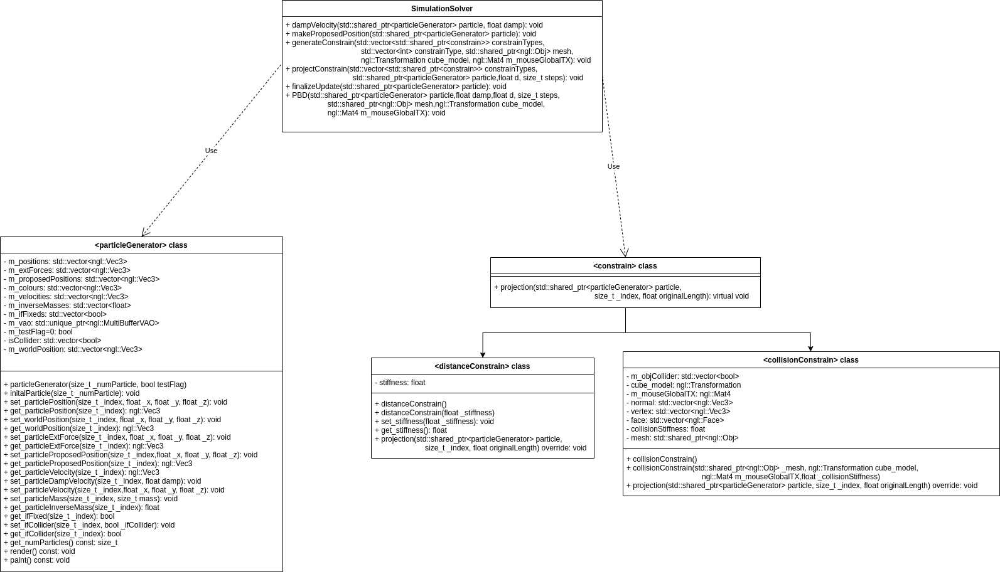

# Ashley Ho Assignment -- Position Based Dynamics

## Overall Idea

### abstract

PositionBasedDynamics is a method that enables mechanical effects based on physics simulation in the graphics community. As opposed to PBA (Physically Based Animation) in the traditional industry, PBD offers more realistic visual effects and highly computationally efficient simulations, it is capable of computing the position changes in each simulation step directly([Miles Macklin 2007](https://www.sciencedirect.com/science/article/pii/S1047320307000065)).

The goal of this project is to develop a position-based dynamics library according to algorithms and mathematical equations provided in academic researches. Afterwards, it adds features including XPBD constraints ([Miles Macklin 2016](https://doi.org/10.1145/2994258.2994272)), and gives compared results when implemented on deformable solids using real-time visualization with OpenGL.

### development environment

- build system generator: [CMake](https://cmake.org/)
- build system: [Ninja](https://ninja-build.org/)
- compiler: [GCC 11.2.1 x86_64-redhat-linux](https://linux.die.net/man/1/gcc)
- Integrated Development Environment (IDE): [Visual Studio Code](https://code.visualstudio.com/) 
- C++ libraries:
  - NCCA graphics library: [ngl](https://github.com/NCCA/NGL)
  - general-purpose: C++ Standard Library
  - string formatting: [fmt](https://fmt.dev/latest/index.html)
  - automated testing: [Google Test](https://github.com/google/googletest)
  - graphical user interface (GUI): [Qt](https://www.qt.io/)
- package manager: [vcpkg](https://github.com/Microsoft/vcpkg)
- version control system (VCS): [Git](https://git-scm.com/)

## Class Design

### Algorithm Outline
```c++
// initialize position x_i, velocity v_i, mass w_i=1/m_i
for each Particle i do
  initialize x_i=x_0; v_i=v_0; w_i=1/m_0;
end
// explicit euler step for integrating the external force into velocity and update position
for each Particle i do
  v_i=v_i+deta_t*f_ext(x_i);
  p_i=x_i+deta_t*v_i; //p is proposed target position of the particles
end
// generate collision constrains
for each particle i do
  distance_constraints(p1,p2)=Normalized(p1-P2)-d; 
  bending_constraints(p1,p2,p3,p4)=acos(n1/Normalized(n1).dot(n2/Normalized(n2))); 
  collision_constraints(p)=(p-qc).dot(nc); //qc is the poiont intersects the collider
end
// solver iterations step, do constraints projection
for each iteration do
  //solve distance_constraints,bending_constraints,collision_constraints
  for each constraint C do
    for each particle i affected by C do
      check if C approx 0;
      modify data;
    end
  end
end
//update data to use for next loop
for each particle i do
  update velocity v_i=(p_i-x_i)/deta_t;
  update position x_i=p_i;
end
```
### Process Diagram


### Class Diagrams


## Reference
M¨uller M., Heidelberger B., Hennix M. and Ratcliff J., April 2007. Position based dynamics. J. Vis. Comun. Image Represent., 18(2),109–118. https://www.sciencedirect.com/science/article/pii/S1047320307000065

Miles Macklin, Matthias Müller, and Nuttapong Chentanez. 2016. XPBD: position-based simulation of compliant constrained dynamics. In Proceedings of the 9th International Conference on Motion in Games (MIG '16). Association for Computing Machinery, New York, NY, USA, 49–54. https://doi.org/10.1145/2994258.2994272

